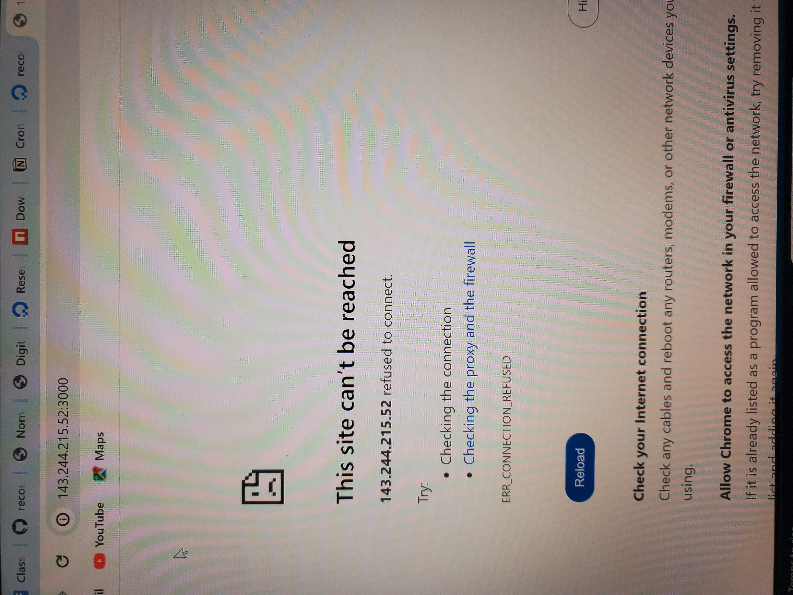
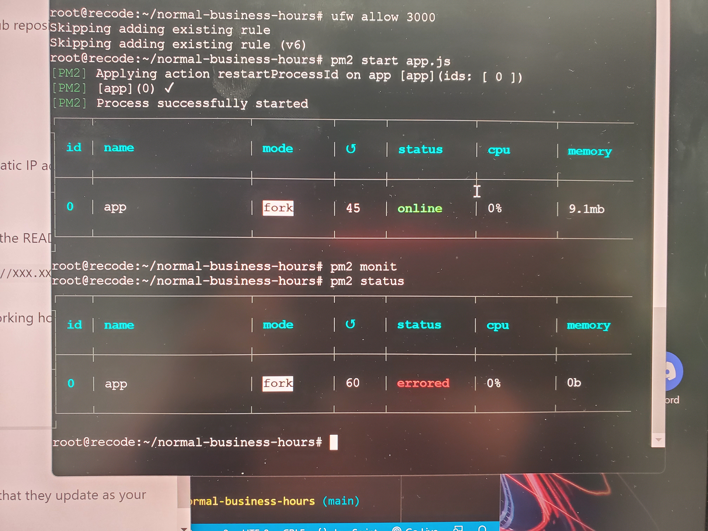
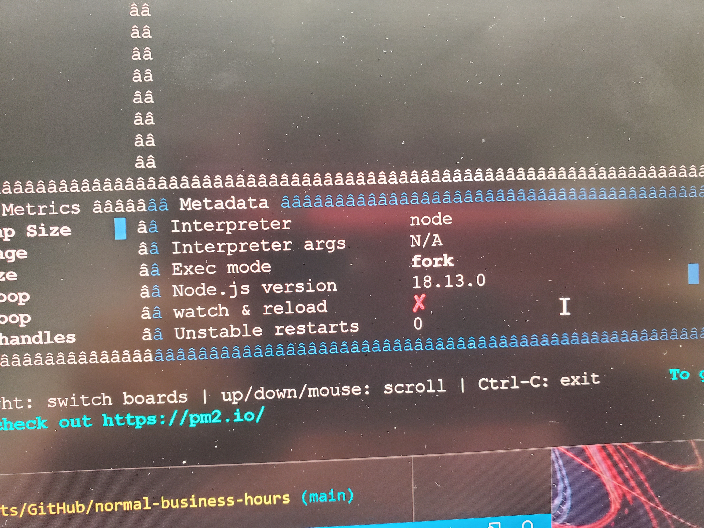
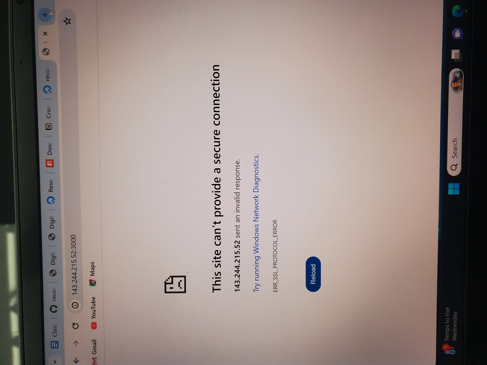
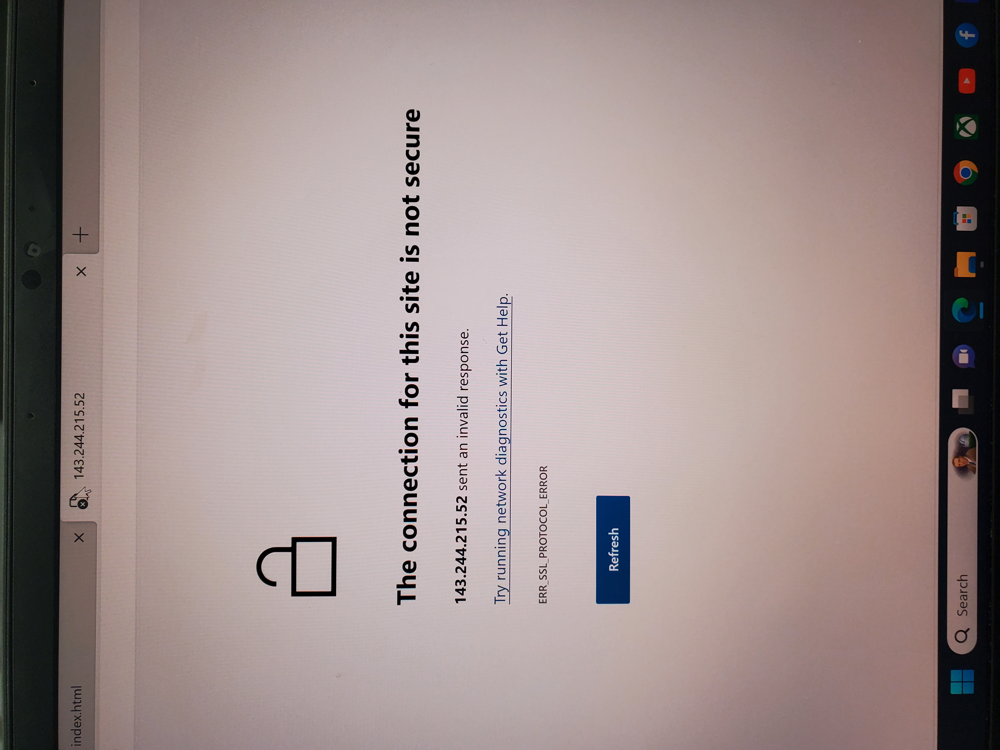
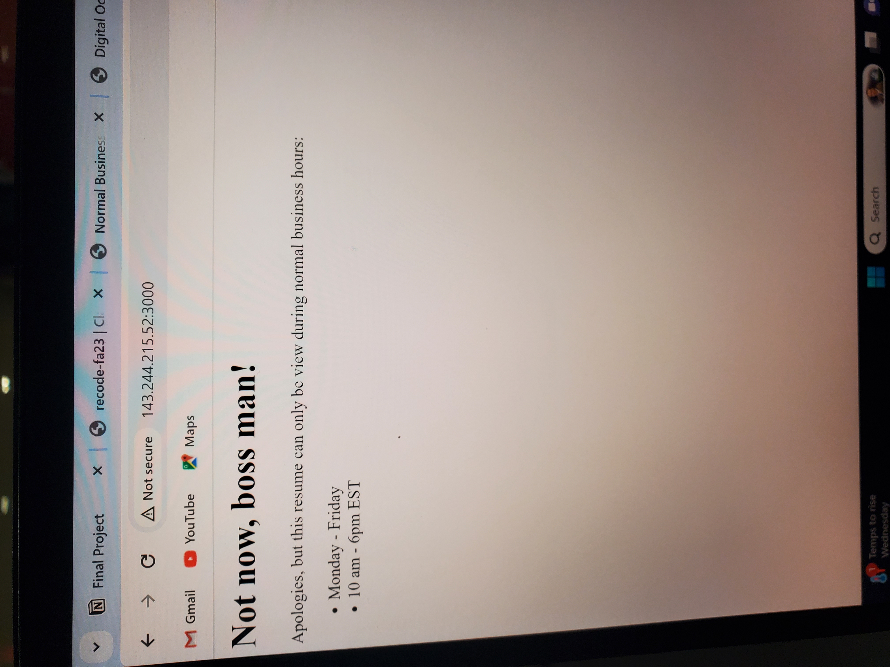
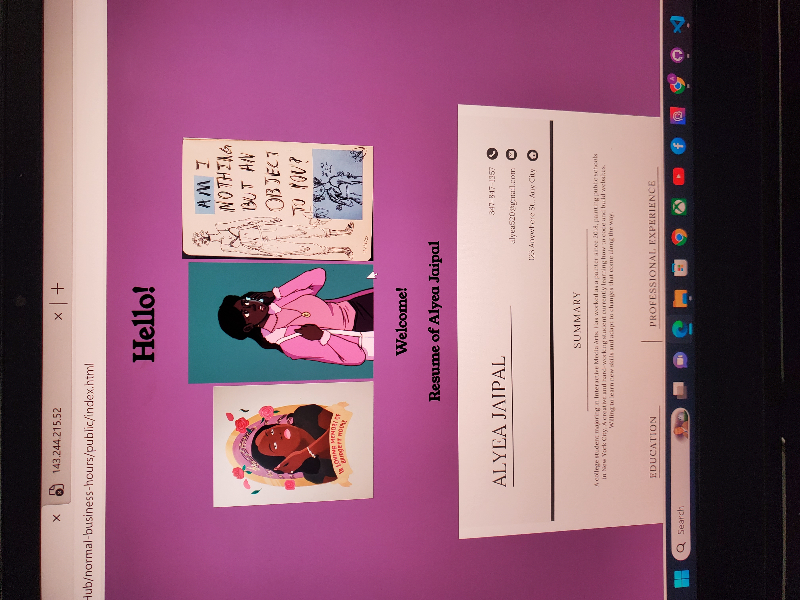
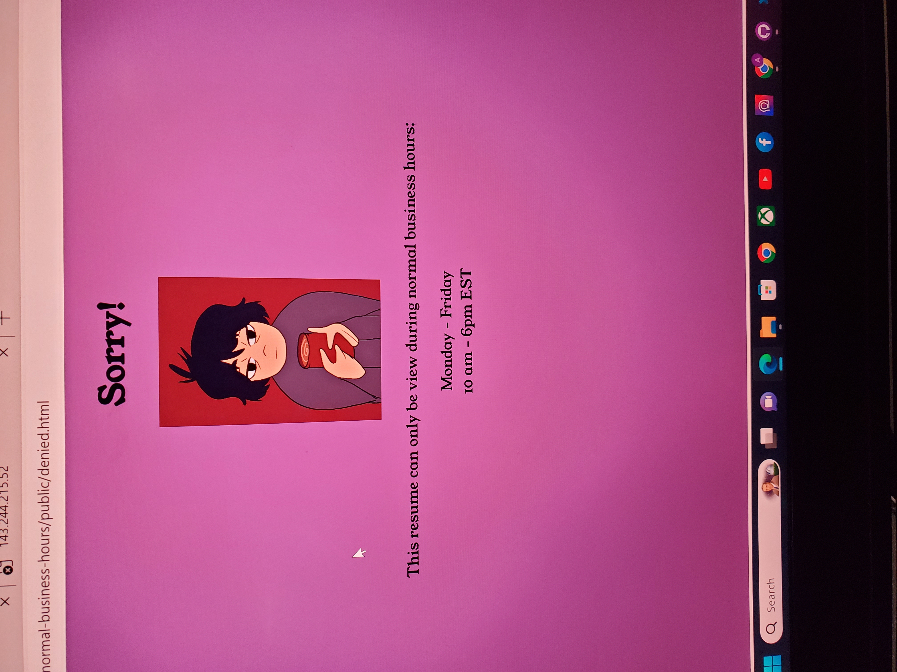

# Normal Business Hours
*Part of an assignment for the ReCode class at NYU's IMA program, Fall 2023.*

Starter code for a website that serves your resume only during your normal business hours. Otherwise, it returns a simple message explaining when potential employers can return to find the information they seek.

[INSTRUCTIONS ARE HERE](https://billythemusical.github.io/recode-fa23/modules/07-servers/normal-business-hours.html) 

## Things I value 
Hobbies: 
I have a lot of hobbies that are creative based and can take up a lot of time without moderation. The creative process can be tedious at times and I tend to do them during late afternoon/evening/night. 

Family/Friends: 
My family and friends tend to have busy schedules so availability can be tricky. My most of family and friends tend to be more active at night so we'd usually plan something at night. So I want to be off the clock by night.

Creative Pursuits: 
I want to be able to have some energy left to work on my creative pursuits since I'll have some ideas I want to get down and work on but sometimes I don't have the energy. I want to be able to dedicate at least an hour on them.

## Working Hours 
I chose 10 a.m. to 6 p.m. since I have a hard time waking up before 7 a.m. without feeling so tired even if I had around 8 hours of sleep. By 6 p.m., I'll still have time for the things I want to do even without feeling absolutely exhausted. 

## Errors Made 
I made a few errors though it's mostly from mispellings and forgetting to install npm. 

I was getting this screen about the ip refusing to connect. It took me a while to realize I didn't have the npm install in the git clone when I reread the instructions for cloning. 
 

I checked the pm2 monitor and didn't understand what I was looking at but I saw no errors.
I used pm2 status and saw I was getting an error that the app had errored. 
 

I noticed this x on watch and reload and thought it meant something but turned out to be nothing big. 

I stopped getting errors after getting the npm installed though the site still wouldn't load. After an email, I realized I was mistyping http//:. 
 
 

It works now but my changes didn't seem to go through. I did save my changes prior to working with the droplet though I think it may be because I did a little change in the app.js file during working with the droplet. 
 

This what the pages were supposed to look like: 
 

## Process 
This was not as tedious as the last assignment and it was pretty easy despite the errors and mistakes made. I liked be able to customize the idex.html pages and the style.css page and designing the website to look how I want. That was the funnest part and the time I spent most on. Most of the errors mainly came from mistyping and forgetting a step. Though I was getting frustrated as to why my changes weren't being saved. Could be that I didn't change the name of the forked repository but that would make any sense. I did rename the repository though I think that might have confused things. It seemed like a simple assignment yet I'm still not used to using the droplets.